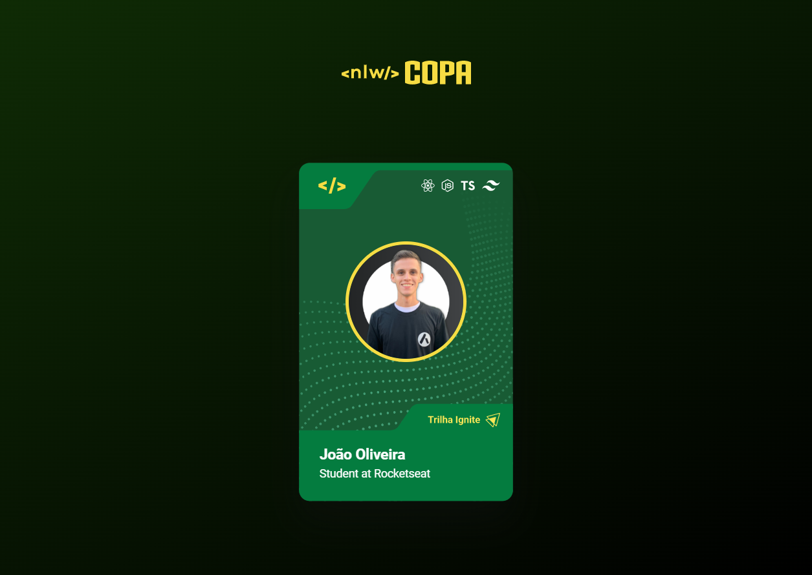

# Figurinha da Copa - Aquecimento NLW COPA

> ## Trilha Ignite

Projeto construído durante a aula de aquecimento no YouTube para o evento Next Level Week da Rocketseat 🚀

[ 🔗 Clique aqui para acessar](https://joaoliveirapb.github.io/figurinha-da-copa/)

## Funcionalidade
Clicando duas vezes na figurinha, ela muda para o cartão da trilha explorer, alterando sua cor e seus dados.

## 🛠️ Tecnologias
- HTML
- CSS
- JS
- Git e GitHub

## 💙 Contato
joaoliveira.batista1@gmail.com